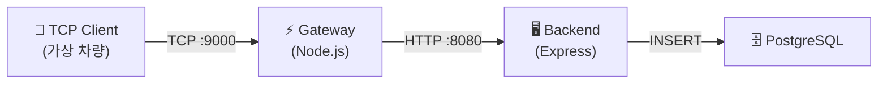

# AIMS E2E HELLO

> 차량 TCP 메시지 수신부터 DB 저장까지, 최소 End-to-End 흐름을 검증하는 예제 프로젝트

### 아키텍처



이 프로젝트는 AIMS 전체 기능을 구현하는 것이 아니라,
**HELLO 메시지 한 건이 차량에서 출발해 DB에 도달하는 최소 경로**가 정상 동작하는지 확인하는 데 집중한다.

---

## 구성 요소

### Gateway

- Node.js 기반 TCP 서버
- `9000` 포트에서 **newline-delimited JSON** 메시지를 수신
- `type === "HELLO"` 인 메시지만 Backend로 전달
- 처리 결과에 따라 `OK` / `ERR` / `IGNORED` 응답 반환

### Backend

- Node.js Express 서버
- `POST /ingest/hello` 엔드포인트 제공
- `type`, `vehicle_id`, `firmware_version`, `timestamp` 필드 검증
- 유효한 메시지를 PostgreSQL에 저장

### PostgreSQL

- `hello_messages` 테이블에 수신 메시지 저장
- 주요 컬럼: `vehicle_id`, `firmware_version`, `ts`, `raw_json`, `created_at`

---

## 테스트 대상 메시지

```json
{
  "type": "HELLO",
  "vehicle_id": "VHC-001",
  "firmware_version": "1.0.0",
  "timestamp": "2026-03-19T13:12:58+09:00"
}
```

실제 전송은 한 줄 JSON + 개행(`\n`) 형태로 이루어진다.

---

## 시뮬레이터

실제 차량 보드 없이도 TCP 흐름을 검증할 수 있도록 `simulator/` 디렉토리에 Python 기반 가상 차량 클라이언트를 포함한다.

| 시나리오 | 설명 |
|---|---|
| 단일 1회 | 차량 1대가 HELLO 메시지 1건 전송 |
| 단일 반복 | 차량 1대가 N회 반복 전송 |
| 단일 지속 | 차량 1대가 일정 간격으로 계속 전송 |
| 다중 동시 | 여러 차량이 동시에 전송 |
| 원격 대상 | 외부 네트워크의 Gateway를 대상으로 전송 |

로컬 개발 환경뿐 아니라 원격 Windows + WSL + Docker 환경에서도 운영에 가까운 테스트를 수행할 수 있다.

---

## 프로젝트 범위

이 프로젝트가 **다루는 것**:

- HELLO 메시지 수신 및 validation
- Gateway → Backend → DB 저장 흐름
- Docker Compose 기반 통합 실행
- 외부 네트워크 TCP 송수신
- 시뮬레이터 기반 반복 검증
- 기본 health check

이 프로젝트가 **다루지 않는 것**:

- AIMS의 운영/관제/정비 등 전체 기능

---

## 현재 확인 가능한 항목

- ✅ 로컬 Docker Compose 환경에서 HELLO 흐름 동작
- ✅ 외부 TCP 클라이언트로 Gateway 접속
- ✅ Backend를 통한 DB 저장
- ✅ Python 시뮬레이터로 단일/반복/지속/다중 차량 테스트
- ✅ 운영 반영 후 동일 흐름 재검증

---

## 위치

이 프로젝트는 AIMS의 더 큰 운영·관제·정비 흐름으로 확장하기 전,
**TCP 수신 → 검증 → 저장**이라는 가장 기본적인 동작을 확인하기 위한 출발점이다.